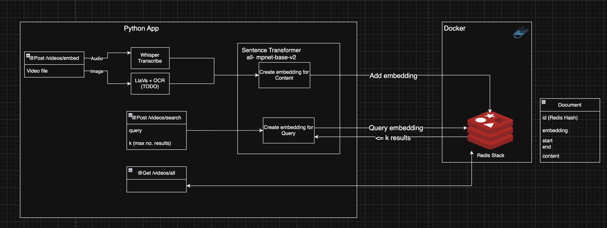
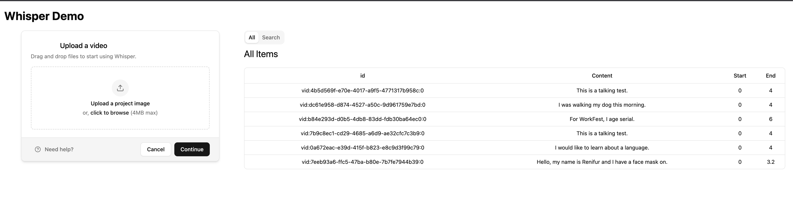
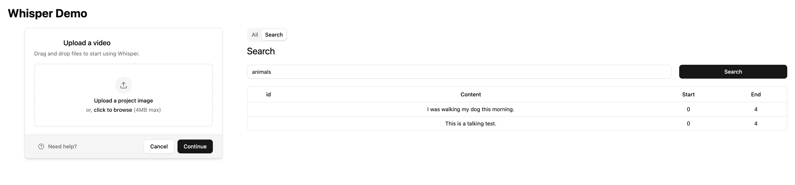

# Using Whisper AI for Video Embeddings
Whisper is speech recognition model developer by Open AI back in 2022. This can be combined with RedisVL to create a model.

This Repo is designed to provide a quickstart way of starting up a whisper application to see how it works.

Below is a diagram of the system and api design.


This application uses ffmpeg to extract the audio so make sure to install this before running the model.

```shell
  brew install ffmpeg
```
## Setup Python App
Note that you will need to use a Python version between 3.9 and 3.14
```shell
  python3.11 -m venv .venv
```

```shell
source ./.venv/bin/activate
```

Download the python packages
```shell
  pip install -r requirements.txt
```

## Setup and Run Redis via Docker
Run a Redis instance locally using the following command
```shell
  docker run -d --name redis -p 6379:6379 -p 8001:8001 redis/redis-stack:latest
```

## Run Python App
```shell
  python -m uvicorn app.main:app --reload
```
## Next Steps
Video frames will be analysed using an OCR in future at a sampling rate of 1 FPS.

# Setup React App
A front end is provided which gives the user an opportunity to upload videos, view a list of the files, and run semantic search against the videos.




You will need to run this alongside the python application and this can be done by navigating into the "frontend" directory and running the following commands.

```shell
  # To install the packages
  npm install
```

```shell
  # To run the application
  npm run dev
```

The application should be running on port 5173, which is important as the middleware on the python application allows communication on this port only.
